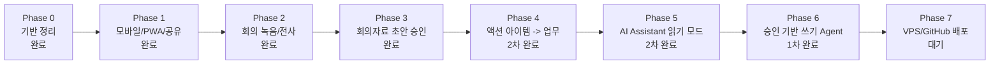

# INTRUTH 개발 Phase 진행상황

> 마지막 업데이트: 2026-05-02
> 목적: 모바일/PWA, 카카오 공유, AI 회의자료, 에이전틱 기능, VPS 배포까지의 현재 처리/미처리 상태를 한눈에 추적합니다.

---

## 전체 흐름

---

## Phase 보드

| Phase | 상태 | 진행률 | 처리된 것 | 남은 것 |
|-------|------|--------|-----------|---------|
| 0. 기반 정리 | ✅ 완료 | ██████████ 100% | 클린 아키텍처, Repository/Service, 실제 서버 모드, 로컬 PostgreSQL | 운영 감사 로그 고도화 |
| 1. 모바일/PWA/카카오 기반 | ✅ 1차 완료 | ██████████ 100% | 모바일 홈, 하단 내비게이션, PWA, 공유 유틸, PDF/카카오 공유 UI, Playwright UI 감사 | Kakao Developers 운영 앱 설정 |
| 2. 회의 녹음/전사 | ✅ 1차 완료 | ██████████ 100% | 녹음 업로드, 서버 저장, OpenAI 전사, 전사 결과 저장/미리보기 | 25MB 초과 파일 압축/청크 |
| 3. 회의자료 초안 승인 | ✅ 1차 완료 | ██████████ 100% | AI 자료 초안 저장, 초안 목록/적용/폐기 API, 모바일 승인 UI, 회의자료/액션아이템 반영 | 감사/비용 로그 연결 |
| 4. 액션 아이템 -> 업무 | ✅ 2차 완료 | ██████████ 100% | 회의 할 일 선택, 승인 후 Task 생성, MeetingActionItem-Task 연결, 중복 전환 방지, 담당자 이름 자동 매칭, 생성 직후 카카오 공유, 업무 후보 카드 편집 | 운영 중 피드백 반영 |
| 5. AI Assistant 읽기 모드 | ✅ 2차 완료 | █████████░ 90% | 멤버별 미완료 업무/회의/프로젝트 읽기, 범위 선택, OpenAI/로컬 요약, 모바일 AI 요청 패널, 카카오 브리핑 공유, 최근 요청 기록/재열람, 토큰 사용량 기록 | 대화형 문맥 이어가기, 비용 단가 운영 설정 |
| 6. 승인 기반 쓰기 Agent | ✅ 1차 완료 | █████░░░░░ 50% | `AiAgentAction` 모델, 업무 초안 생성, 승인/거절 카드, 승인 후 Task 생성, 실행 로그, 전역 AI 명령 채팅 패널 | 회의/프로젝트/루틴 생성 도구, 수정 diff 승인, 서버 tool registry |
| 7. VPS/GitHub 배포 | ⏳ 대기 | ░░░░░░░░░░ 0% | GitHub 저장소 준비 | Docker/Nginx/HTTPS/PostgreSQL/환경변수/배포 자동화 |

---

## 지금 완료된 핵심 결과

- INTRUTH 브랜드/모바일 UI 기반 정리
- PWA 설치 준비와 모바일 하단 내비게이션
- 회의자료 PDF/카카오 공유 1차 흐름
- OpenAI API 기반 회의 녹음 전사
- 전사 기반 회의자료 초안 생성
- 사람이 확인한 뒤 적용하는 human-in-the-loop 승인 구조
- 회의 할 일을 선택해 실제 업무로 전환하는 모바일 승인 흐름
- AI가 제안한 담당자 이름을 실제 멤버로 연결하는 기본 매칭
- 생성된 업무 묶음을 카카오톡 공유용 문구로 즉시 공유하는 흐름
- 회의 할 일을 업무로 만들기 전 제목/설명/담당자/마감일/우선순위 편집
- 로그인 멤버의 업무/회의/프로젝트를 읽어 답하는 AI Assistant 1차 버전
- AI Assistant 최근 요청 기록 저장과 모바일 재열람
- AI Assistant 조회 범위 선택과 OpenAI 토큰 사용량 기록
- AI가 만든 업무 초안을 사람이 승인한 뒤 실제 Task로 생성하는 1차 쓰기 Agent
- 승인 대기/실행/거절 상태를 기록하는 `AiAgentAction` 실행 로그
- 모든 페이지에서 열리는 `INTRUTH AI 명령` 채팅 패널
- 자연어로 페이지 이동, 새 업무/회의/프로젝트/루틴 창 열기, AI 승인 대기 조회/승인/보류 실행
- 로컬 개발 모드 AI API 포트 설정 보정 및 네트워크 실패 메시지 개선
- Playwright 모바일/데스크톱 UI 감사 통과

---

## 다음 추천 순서

1. Phase 6 확장: AI 명령을 서버 tool registry로 연결해 회의 일정/프로젝트/루틴 생성까지 승인 기반 실행
2. Phase 6 확장: 수정 작업용 변경 전/후 diff 승인 카드
3. Phase 5 보강: 이전 질문을 문맥으로 이어가는 대화형 흐름
4. Phase 7: GitHub Actions + VPS 배포 자동화

---

## 이번 Phase 3 검증

| 항목 | 결과 |
|------|------|
| 서버 빌드 | ✅ 통과 |
| 클라이언트 빌드 | ✅ 통과 |
| Prisma 마이그레이션 | ✅ 적용 |
| Playwright UI 감사 | ✅ 6 passed, 2 skipped |
| 모바일 초안 승인 흐름 | ✅ 초안 표시, 적용, DB 반영 확인 |
| 로컬 API 상태 | ✅ `http://127.0.0.1:3002/api/health` 정상 |

---

## 이번 Phase 4 검증

| 항목 | 결과 |
|------|------|
| MeetingActionItem-Task 연결 마이그레이션 | ✅ 적용 |
| 서버 빌드 | ✅ 통과 |
| 클라이언트 빌드 | ✅ 통과 |
| 회의 할 일 업무 전환 UI | ✅ 모바일 승인 카드 추가 |
| 업무 전환 API 실제 호출 | ✅ 임시 회의 할 일 1개 -> Task 1개 생성 확인 |
| 권한 미들웨어 점검 | ✅ 역할 권한 JSON 파싱 수정 |
| 담당자 이름 자동 매칭 | ✅ AI `ownerName` -> 실제 멤버 `assigneeId` 연결 확인 |
| 생성 업무 카카오 공유 | ✅ 생성 직후 공유 카드와 카카오/Web Share fallback 추가 |
| 업무 후보 편집 API | ✅ 편집된 제목/담당자/마감일/우선순위로 Task 생성 확인 |

---

## 이번 Phase 5 검증

| 항목 | 결과 |
|------|------|
| AI Assistant Service | ✅ 로그인 멤버의 업무/회의/프로젝트 컨텍스트 조회 |
| AI Assistant API | ✅ `/api/ai/assistant/ask` 실제 호출, OpenAI 응답 확인 |
| 모바일 AI 요청 UI | ✅ 홈 빠른 타일과 하단 패널 추가 |
| 카카오 브리핑 공유 | ✅ Assistant 응답의 `kakaoBrief` 공유 버튼 추가 |
| AI Assistant 기록 | ✅ `AiAssistantRun` 저장 및 `/api/ai/assistant/runs` 조회 확인 |
| AI Assistant 범위 선택 | ✅ 프로젝트 범위 API 호출과 기록 저장 확인 |
| OpenAI 토큰 사용량 기록 | ✅ `usage.total_tokens` 저장 및 모바일 표시 확인 |
| Playwright UI 감사 | ✅ 6 passed, 2 skipped |

---

## 이번 Phase 6 검증

| 항목 | 결과 |
|------|------|
| AiAgentAction 마이그레이션 | ✅ `20260501050000_add_ai_agent_actions` 적용 |
| 업무 초안 생성 API | ✅ `/api/ai/assistant/task-drafts` 실제 호출 확인 |
| 승인 후 Task 생성 API | ✅ 업무 초안 5개 승인 후 Task 5개 생성 확인 |
| 테스트 업무 정리 | ✅ 생성된 검증용 Task 삭제 완료 |
| 서버 빌드 | ✅ 통과 |
| 클라이언트 빌드 | ✅ 통과 |
| Playwright UI 감사 | ✅ 6 passed, 2 skipped |
